# `docker-compose up -d` is an easy button

Introduction to the docker-compose tool
by Matt Payne, Twitter.com/MattPayneOrg
4 August 2020
https://payne.github.io/docker-compose-talk
Pull Requests are welcome!

Slide tool: https://marp.app/

----
# Many Thanks, Chad!
1. Chad has stoked my enthusiasm for Docker & docker-compose
1. Five months ago, while OLUG was eating Tacos Chad helped me see that 
authentication & authorization could be farmed out to a docker image in a docker compose network.  SWEET!
3. He also taught me the command **`docker search fava`**


----
# Agenda -- Let's have fun.  Questions & tangents welcome
1. Why?
1. Tour of Docker Compose Syntax
1. Setup on Ubuntu 20.04 -- Live demos avaliable
1. Beancount & fava use case
1. OAuth2 proxy use case -- AMAZING!
1. TODO: SSL termination with nginx
1. TODO: Let's Encrypt
1. TODO: Spring boot, angular, postgresql use case
1. TODO: WAF use case
1. Tips & References

----
# Why Docker? - Easy & portable container 
1. Starts faster than pure Virtual Machine
2. How can docker containers be combined to make things easier?
    Answer: docker-compose!
3. What's easier than Docker files?  
    Answer: docker-compose.yml 

----
# Tour of Docker Compose
1. docker-compose up -d 
2. docker-compose down -v # -v is optional and clears volumes managed by Docker
3. docker-compose exec -T apache ls -lR /www
4. docker-compose restart fava
5. docker-compose logs -f fava

## TODO: More commands!

----
# dockder-compose.yml parts
1. services
   A. ports -- external:internal mapping
   B. Environment variables
     1. within docker-compose.yml
     1. From text file.
1. networks
1. volumes (file or internal)
1. TODO: Secrets

----
# Example: docker on Ubuntu 20.04
1. https://www.digitalocean.com/community/tutorials/how-to-install-and-use-docker-on-ubuntu-20-04

```
    1  sudo apt update
    2  apt install apt-transport-https ca-certificates curl software-properties-common
    3  curl -fsSL https://download.docker.com/linux/ubuntu/gpg | sudo apt-key add -
    4  add-apt-repository "deb [arch=amd64] https://download.docker.com/linux/ubuntu focal stable"
    5  apt update
    6  apt-cache policy docker-ce
    7  apt install docker-ce
    8  systemctl status docker
    9  grep payne /etc/passwd
   10  adduser mpayne
   11  usermod -aG docker mpayne
   12  history
```
2. Login as mpayne and run: `docker run hello-world`

----
# Example: docker-compose on Ubuntu 20.04
1. https://www.digitalocean.com/community/tutorials/how-to-install-and-use-docker-compose-on-ubuntu-20-04

```
   1  sudo curl -L "https://github.com/docker/compose/releases/download/1.26.0/docker-compose-$(uname -s)-$(uname -m)" -o /usr/local/bin/docker-compose
   2  sudo chmod +x /usr/local/bin/docker-compose
   3  docker-compose --version
```


----
# Use case: Beancount & Fava & OAuth

Background... I'd like to secure Beancount online.   This is the 
authentication & authorization could be farmed out to a docker image in a docker compose network bit...

1. https://plaintextaccounting.org/ is a DIY alternative to YNAB.com etc
1. One of many Plain Text Accounting programms is [Beancount](http://furius.ca/beancount/)
1. [Fava](https://beancount.github.io/fava/) is a Web GUI that fronts [Beancount](http://furius.ca/beancount/)
1. Took bean.fava from https://github.com/wileykestner/beancount-example's plugin-example.beancount file.


----
# First step just fava in: docker-compose.yml
```
version: "3.7"
services:
  fava:
    image: yegle/fava
    ports:
      - 8080:5000
    volumes: 
    - ./data:/data/
    environment:
      BEANCOUNT_FILE: /data/fava.bean
```
# `docker-compose up -d`
1. Now visit http://localhost:8080 :-) 
   A. Note the port mapping (external:internal)
1. Note, adding a transaction will change data/fava.bean

-----
# Example: fava first: `docker-compose up -d`
```
mpayne@localhost:~/docker-compose-talk/fava$ docker-compose up -d
Creating network "fava_default" with the default driver
Pulling fava (yegle/fava:)...
latest: Pulling from yegle/fava
6729630f5ebf: Pull complete
e2745900642c: Pull complete
c5900d68e237: Pull complete
71c3ced08a8f: Pull complete
ad7239340312: Pull complete
Digest: sha256:b9eed1e3f5da70768571cfe33a0a6ea2954bc6af976f4f5565bb15f2880d442c
Status: Downloaded newer image for yegle/fava:latest
Creating fava_fava_1 ... done
mpayne@localhost:~/docker-compose-talk/fava$ docker-compose ps
   Name       Command   State           Ports
------------------------------------------------------
fava_fava_1   fava      Up      0.0.0.0:8080->5000/tcp
mpayne@localhost:~/docker-compose-talk/fava$
```

-----
# Example: fava first visit http://CS-mcc.org:8080
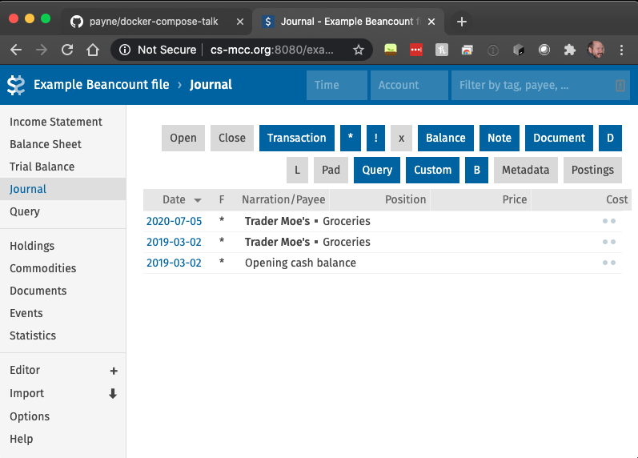
Note that we can add transactions and they are saved outside of docker!

----
# But we could just use venv
1. `python3.8 -m venv fava`
1. `source fava/bin/activate`
1. `pip3.8 install fava`
1. `fava data/fava.bean`

-----
# OAuth2-Proxy is great
1. https://github.com/oauth2-proxy/oauth2-proxy
   * "A reverse proxy that provides authentication with Google, Github or other providers."
1. https://github.com/namuan/oauth2-proxy-httpbin is an example on how to use this.
   * My fork is https://github.com/payne/oauth2-proxy-httpbin

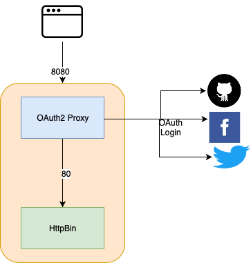

-----
Example: OAuth2-proxy-httpbin - Make an "application"
1. https://github.com/namuan/oauth2-proxy-httpbin
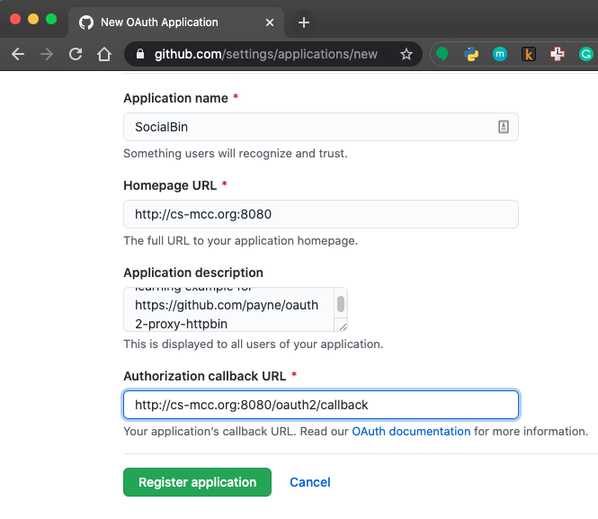

-----
Example: OAuth2-proxy-httpbin: `docker-compose up`
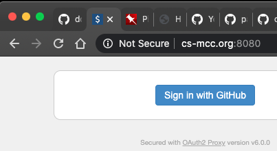

-----
Example: OAuth2-proxy-httpbin: Authorize it!
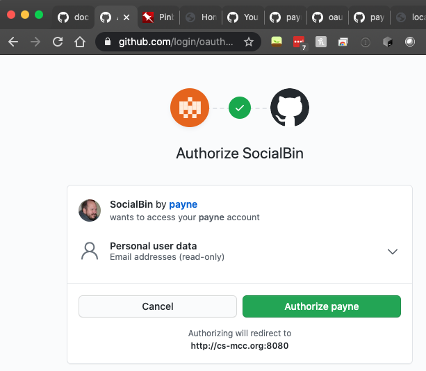

-----
Example: OAuth2-proxy-httpbin: After authorized
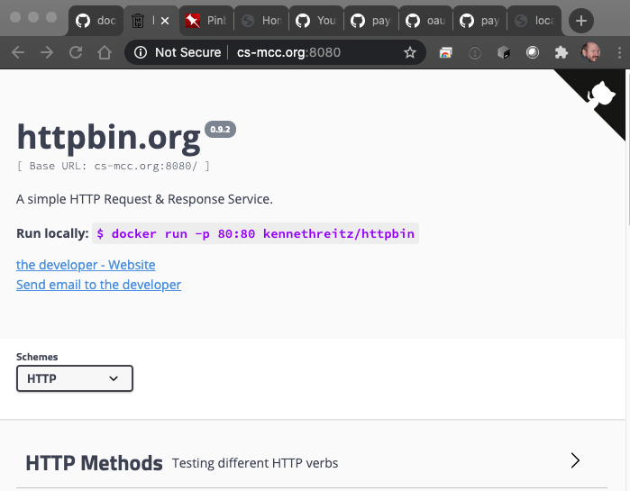

-----
Example: OAuth2-proxy-httpbin: The Magic Cookie
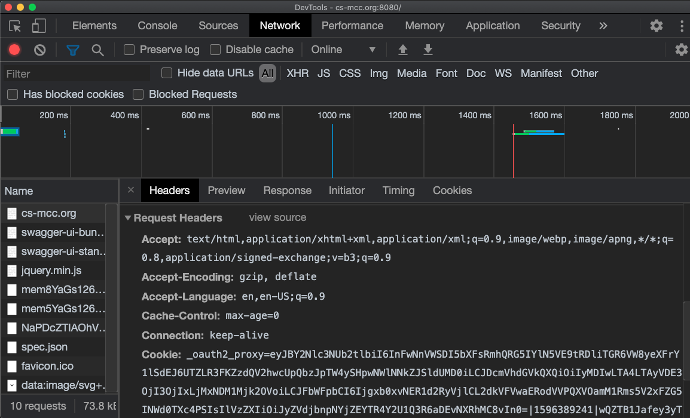

----
Example: OAuth2-proxy restricting who can login
1. https://oauth2-proxy.github.io/oauth2-proxy/configuration
   1. `--github-repo` -- restrict logins to collaborators of this repository formatted as orgname/repo
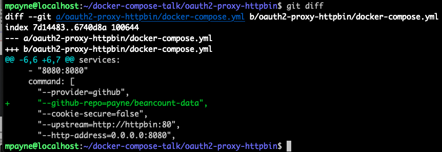

----
Example: Invite Collabortor to repo 
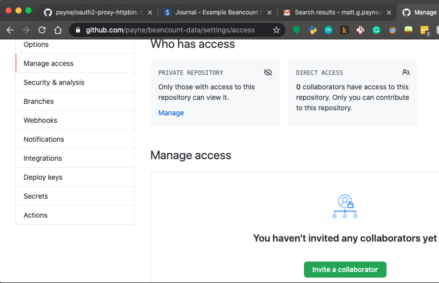

-----
Example: github-user works but github-repo fails
[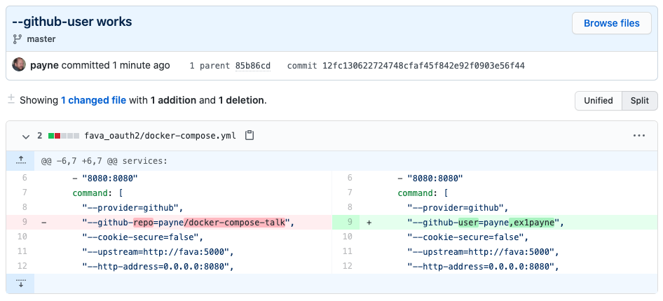](https://github.com/payne/docker-compose-talk/commit/12fc130622724748cfaf45f842e92f0903e56f44)
So, [here is what the docker-compose.yml looks like](https://github.com/payne/docker-compose-talk/blob/master/fava_oauth2/docker-compose.yml)

----
TODO: SSL: Let's Encrypt
1. https://www.humankode.com/ssl/how-to-set-up-free-ssl-certificates-from-lets-encrypt-using-docker-and-nginx
   * I assume this includes SSL termination

----
# Use case: spring boot, angular, postgresql 

Maybe start with Matt R's Okta blog posts on this....

----
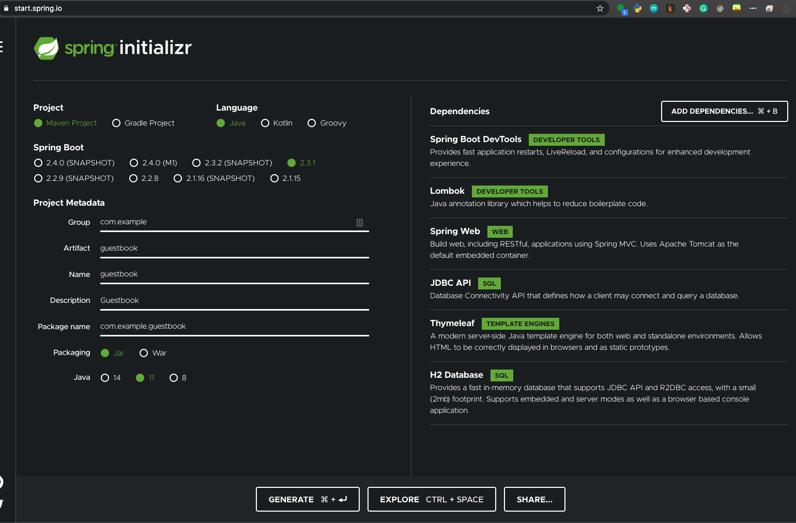

----
# Use case: Web Application Firewall (WAF)

1. https://github.com/theonemule/docker-waf
1. https://www.wintellect.com/securing-docker-containers-with-a-web-application-firewall-waf-built-on-modsecurity-and-nginx/

-----
# TIP: docker image tags
* https://docs.bitnami.com/tutorials/understand-rolling-tags-containers/

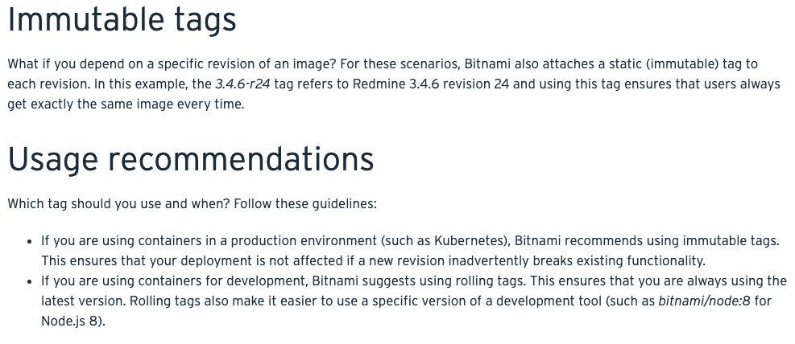

-----
# TODO TIP: docker security things to keep in mind...

--------
# Reference: The Docker Handbook
1. https://www.freecodecamp.org/news/the-docker-handbook/

--------
# References: thanks [Wes Turner](https://twitter.com/westurner)
Many thanks to @WesTurner for this great twitter thread filled with wonderful tips:
1. [Helpful notes](https://twitter.com/westurner/status/1289689456904032256?s=20)
1. [Traefix Proxy 2.0 Docker Basic Tutorial](https://twitter.com/westurner/status/1290194481489145856)

Wes is one of the most helpful folks I know: 


