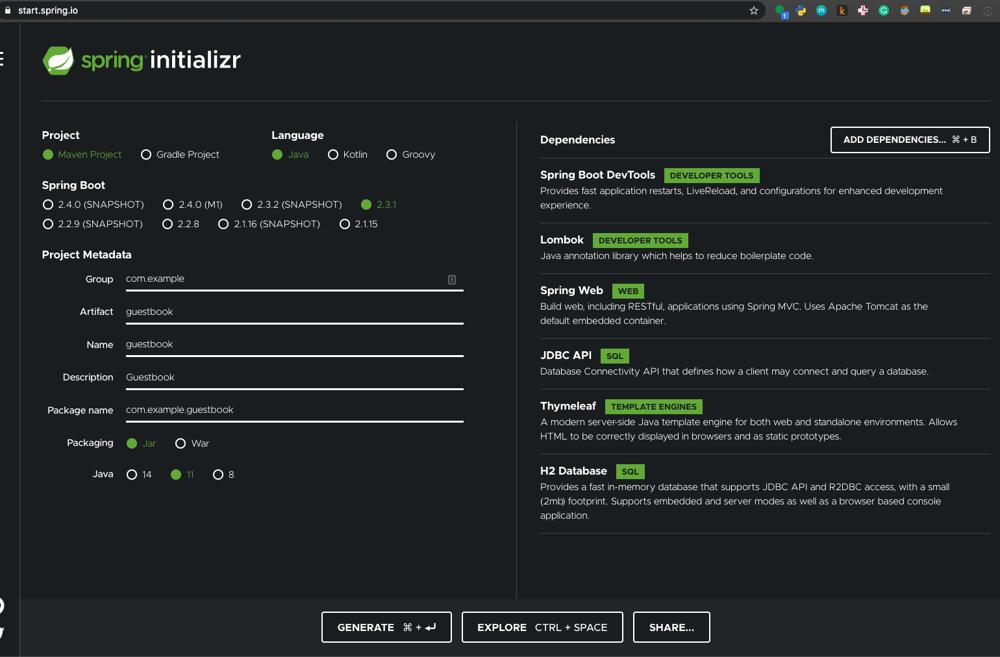

# docker-compose up -d # an easy button

Introduction to the docker-compose tool
by Matt Payne, Twitter.com/MattPayneOrg
4 August 2020
https://payne.github.io/docker-compose-talk


Slide tool: https://marp.app/

----
# Docker - Easy & portable container 
1. Starts faster than Virtual Machine
2. How can docker containers be combined to make things easier?
    A: docker-compose!

----
# Agenda
1. Tour of Docker Compose
1. Spring boot, angular, postgresql use case
1. Beancount use case
1. WAF use case
1. Heroku?

----
# Tour of Docker Compose
1. docker-compose up -d 
2. docker-compose down
3. docker-compose exec -T apache ls -lR /www
4. docker-compose restart fava
5. docker-compose logs -f fava

----
# dockder-compose.yml parts
1. services
   A. ports
   C. Secrets
   B. Environment variables
     1. within docker-compose.yml
     1. From text file.
1. networks
1. volumes (file or internal)

----
# Use case: Beancount & OAuth

Background... I'd like to secure Beancount online

1. https://plaintextaccounting.org/ is a DIY alternative to YNAB.com etc
1. One of many Plain Text Accounting programms is [Beancount](http://furius.ca/beancount/)
1. [Fava](https://beancount.github.io/fava/) is a Web GUI that fronts [Beancount](http://furius.ca/beancount/)
1. Took bean.fava from https://github.com/wileykestner/beancount-example's plugin-example.beancount file.


----
# docker-compose.yml
```
version: "3.7"
services:
  fava:
    image: yegle/fava
    ports:
      - 8080:5000
    volumes: 
    - ./data:/data/
    environment:
      BEANCOUNT_FILE: /data/fava.bean
```
# `docker-compose up -d`
1. Now visit http://localhost:8080 :-) 
   A. Note the port mapping (external:internal)
1. Note, adding a transaction will change data/fava.bean

----
# Use case: spring boot, angular, postgresql 


----



----
# Use case: Web Application Firewall (WAF)

1. https://github.com/theonemule/docker-waf
1. https://www.wintellect.com/securing-docker-containers-with-a-web-application-firewall-waf-built-on-modsecurity-and-nginx/


----
# Heroku - Platform as a Service takes docker!?

1. Does it really?  This is a stretch goal

----
# Example: docker on Ubuntu 20.04
1. https://www.digitalocean.com/community/tutorials/how-to-install-and-use-docker-on-ubuntu-20-04

```
    1  sudo apt update
    2  apt install apt-transport-https ca-certificates curl software-properties-common
    3  curl -fsSL https://download.docker.com/linux/ubuntu/gpg | sudo apt-key add -
    4  add-apt-repository "deb [arch=amd64] https://download.docker.com/linux/ubuntu focal stable"
    5  apt update
    6  apt-cache policy docker-ce
    7  apt install docker-ce
    8  systemctl status docker
    9  grep payne /etc/passwd
   10  adduser mpayne
   11  usermod -aG docker mpayne
   12  history
```
2. Login as mpayne and run: `docker run hello-world`

----
# Example: docker-compose on Ubuntu 20.04
1. https://www.digitalocean.com/community/tutorials/how-to-install-and-use-docker-compose-on-ubuntu-20-04

```
   1  sudo curl -L "https://github.com/docker/compose/releases/download/1.26.0/docker-compose-$(uname -s)-$(uname -m)" -o /usr/local/bin/docker-compose
   2  sudo chmod +x /usr/local/bin/docker-compose
   3  docker-compose --version
```

-----
# Example: fava first: `docker-compose up -d`
```
mpayne@localhost:~/docker-compose-talk/fava$ docker-compose up -d
Creating network "fava_default" with the default driver
Pulling fava (yegle/fava:)...
latest: Pulling from yegle/fava
6729630f5ebf: Pull complete
e2745900642c: Pull complete
c5900d68e237: Pull complete
71c3ced08a8f: Pull complete
ad7239340312: Pull complete
Digest: sha256:b9eed1e3f5da70768571cfe33a0a6ea2954bc6af976f4f5565bb15f2880d442c
Status: Downloaded newer image for yegle/fava:latest
Creating fava_fava_1 ... done
mpayne@localhost:~/docker-compose-talk/fava$ docker-compose ps
   Name       Command   State           Ports
------------------------------------------------------
fava_fava_1   fava      Up      0.0.0.0:8080->5000/tcp
mpayne@localhost:~/docker-compose-talk/fava$
```

-----
# Example: fava first visit http://CS-mcc.org:8080


--------
# Thanks [Wes Turner](https://twitter.com/westurner)
Many thanks to @WesTurner for this great twitter thread filled with wonderful tips:
* https://twitter.com/westurner/status/1289689456904032256?s=20

Wes is one of the most helpful folks I know: 


